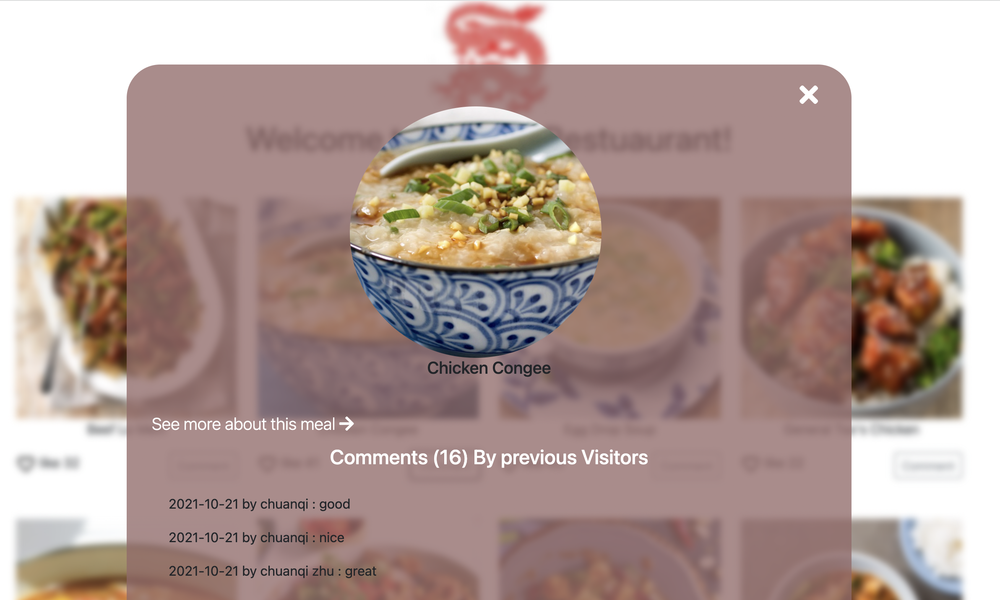

## Project Description
The JavaScript capstone project (remember what they are?) is about building your own web application based on an external API. You will select an API that provides data about a topic that you like and then build the webapp around it. 


## Things done so far:

### **Student A**
Chuanqi Zhu

### **Student B**
Alexander Mayowa


## Built With

- Major languages:  
  - HTML
  - CSS
  - JS


- Technologies used: 
  - Lighthouse
  - Webhint
  - Stylelint
  - ESLint
  - Webpack
  - Jest
  - Kanban Board
  -  involvement API
  -  host APi


## Getting Started

To get a local copy up and running, follow the steps below in your terminal.

### Prerequisites

- Node.js
- npm

### Setup

Clone the project on CMD:

```
git clone https://github.com/alexander16108/Javascrript-Capstone.git
```

### Install

There are currently no production dependencies.

Install the development dependencies:

```
npm install
```

### Usage

The assets are in the `src` directory.

The output is in the `dist` directory.

<!-- ### Run tests

To run the entire test suite:

```
npm run test
```
 -->
### Deployment

To build the website:

```
npm run build
```

To serve the website directly:

```
npm run start
```


## Screenshot of the page


## Video recording Of the Project


### Live Version Link


### Contributors

***👤Alexander Mayowa Odufuye***

 GitHub : [@alexander16108](https://github.com/alexander16108)
 
 LinkedIn : [Alexander Odufuye]()
 
 
 ***👤Chuanqi Zhu***

 GitHub : [Chuanqi Zhu]()
 
 LinkedIn : [Chuanqi Zhu]()

### 🤝 Contributing
Contributions, issues, and feature requests are welcome!

Feel free to check the [issues](https://github.com/alexander16108/Javascrript-Capstone/issues) page.

#### Show your support
Give a ⭐️ if you like this project!

#### Acknowledgments
- [Microverse](https://microverse.org) for assigning us this project

- The Amazing staff for working round the Clock to make our journey free of bumps.

- The amazing code reviewers for making us improve every day :thumbsup:

### Licence 

 This project is [MIT](https://opensource.org/licenses/MIT) licensed.


<!-- 
# Pokemon Showcase

> This is an interactive web app that displays Pokemon and allows you to like them.


## Video

[watch here](https://www.loom.com/share/806154e3bd1d4ae9890213a8d3f7b332)

This is the JavaScript Capstone project.

 Student A (  ), was resposible for :
- The home page.
- The external API ( PokeAPI ).
- The Involvement API LIKES.
- Testing the item counter
- Styling and dependancies

 Student B (  ), was resposible for :
- The home page.
- The external API ( PokeAPI ).
- The Involvement API LIKES.
- Testing the comment counter
- Styling and dependancies

## Built With

- JavaScript
- Webpack
- HTML & CSS
- Pokemon API (PokeAPI)
- Involvement API

## Live Demo


### Setup

To get a local copy up and running follow these simple example steps.

Click [here]() to go to the repo.

Clone the project by opening your terminal and entering "$ git clone" + "The link supplied".

cd into the repo by typing
$ cd 

$ git checkout development

$ npm install

Open the repo in your code editor and launch it by running '$ npm start' !

## Testing
- run $ npm install --save-dev jest

- followed by '$ npm run test'

## Authors

👤 **Stephan**

Github: @sneeu-leeu

Twitter: @Stephan07484055

Linkedin: Stephan Annandale


## Authors

👤 **Stephan**

Github: @sneeu-leeu

Twitter: @Stephan07484055

Linkedin: Stephan Annandale
## 🤝 Contributing

Contributions, issues, and feature requests are welcome!


Feel free to check the [issues page](https://github.com/sneeu-leeu/To-Do-List/issues/4).

## Show your support

Give a ⭐️ if you like this project!

## 📝 License

This project is [MIT](https://opensource.org/licenses/MIT) licensed. -->
